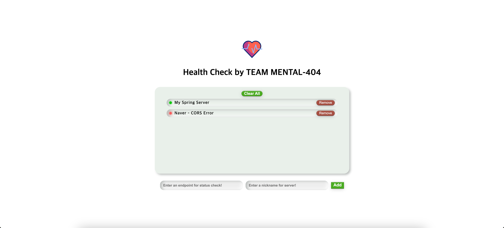

# Intro

배포에 완료한 서버의 활성상태를 어떻게 확인할 수 있을까요?

간단한 상태체크를 위해서 /health 엔드포인트의 응답을 확인하거나  
직접 배포 서버에 접근해서 직접 프로세스 상태를 확인합니다. 
혹은 모니터링 시스템을 마련해야 합니다. 

 

해당 서비스는 배포한 서버의 활성 상태를 제공합니다.  

   

#  Getting Started

[🔗 Health Check 바로가기](https://main--storied-dolphin-620dbc.netlify.app/)  

__✅ CORS allowedOrigin에 해당 서비스 도메인을 추가해야 합니다 !__  
__✅ 확인을 원하는 서버에 HTTPS가 적용되어 있어야 합니다 !__

- 두 필드의 입력이 필요합니다.
    - 헬스체크 엔드포인트
    - 표시되길 원하는 서버 닉네임  
- Add 버튼을 통해서 헬스체크 리스트에 추가합니다.
- Clear All 버튼을 통해서 모든 리스트를 제거할 수 있습니다.  
- 각 라인의 오른쪽에 Remove 버튼을 통해서 하나씩 제거할 수 있습니다.

  

# Data Storage  
해당 서비스는 서버리스입니다.  
유저가 입력한 데이터는 브라우저의 localStrage에 저장됩니다.
그렇기 떄문에, 유저가 임의로 제거하지 않는 이상 브라우저 앱을 재부팅해도 데이터를 유지할 수 있습니다.

  

# Next....

- 현재 새로고침이 아니라면 최신화가 되지 않습니다. 주기적으로  
체킹하는 것은 해당 서버의 요청 횟수 제한에 따라서 원하지 않는 결과를  
보여줄 수 있기 때문에 구현하지 않았습니다. 다른 대안을 생각해보려고 합니다.
- 활성상태에서 서버가 죽을 경우 유저가 알 수 있도록 메신저 관련 API를  
붙여볼 계획입니다.

 

